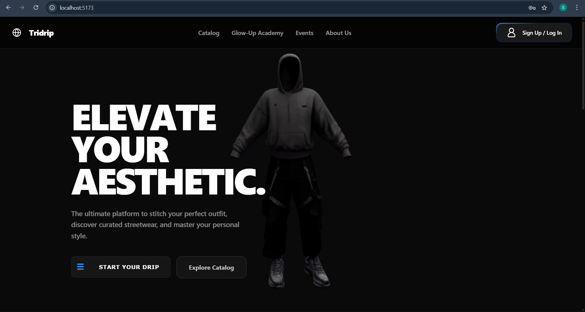
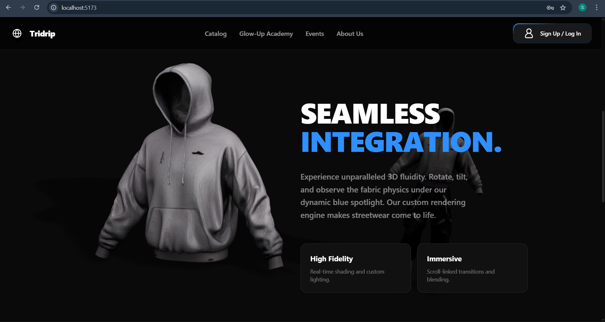
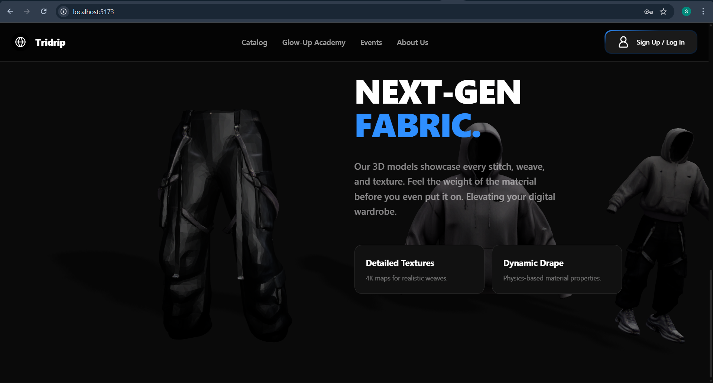

# 👕 Tridrip — Elevate Your Aesthetic.

> The ultimate platform to stitch your perfect outfit, discover curated streetwear, and master your personal style.





---

## ✨ Overview

**Tridrip** is a next-gen streetwear platform built with immersive 3D model visuals and smooth scrollytelling animations. Explore curated fits, interact with fabric physics in real time, and define your drip.

---

## 🖥️ Live Preview

[TriDrip](https://tridrip.vercel.app/)

---

## 🎥 Features

- **3D Model Viewer** — Rotate, tilt, and explore garments with real-time fabric physics and dynamic blue spotlight rendering
- **Scrollytelling UI** — Scroll-linked transitions and cinematic section reveals as you navigate the page
- **High Fidelity Renders** — Real-time shading, custom lighting, and 4K texture maps for every fabric weave
- **Next-Gen Fabric Simulation** — Physics-based material properties and dynamic drape showcased per item
- **Curated Catalog** — Browse hand-picked streetwear collections
- **Glow-Up Academy** — Style education content for mastering your personal aesthetic
- **Events** — Stay plugged into drops, collabs, and community events
- **Sign Up / Log In** — Personalized user experience

---

## 🗂️ Pages

| Page | Description |
|------|-------------|
| `/` | Landing Page — Hero section with 3D mannequin and CTA |
| `/home` | Home Page — Scrollytelling sections: Seamless Integration, Next-Gen Fabric |
| `/catalog` | Browse streetwear catalog |
| `/glow-up-academy` | Style guides and tips |
| `/events` | Upcoming drops and events |
| `/about` | About Tridrip |

---

## 🛠️ Tech Stack

| Layer | Tech |
|-------|------|
| Frontend Framework | React / Vite |
| 3D Rendering | Three.js / Custom WebGL |
| Animations | GSAP ScrollTrigger (Scrollytelling) |
| Styling | CSS Modules / Tailwind CSS |
| Dev Server | Vite (`localhost:5173`) |

> ⚠️ Update this table to match your actual stack if anything differs.

---

## 🚀 Getting Started

### Prerequisites

- Node.js `v18+`
- npm or yarn

### Installation

```bash
# Clone the repo
git clone https://github.com/your-username/tridrip.git

# Navigate into the project
cd tridrip

# Install dependencies
npm install

# Start the dev server
npm run dev
```

Open [http://localhost:5173](http://localhost:5173) in your browser.

### Build for Production

```bash
npm run build
```

Output will be in the `/dist` folder.

---

## 📁 Folder Structure

```
tridrip/
├── public/
│   └── models/          # 3D model assets (.glb / .gltf)
├── src/
│   ├── components/      # Reusable UI components
│   ├── pages/           # Landing, Home, Catalog, etc.
│   ├── assets/          # Images, fonts, icons
│   ├── styles/          # Global CSS / Tailwind config
│   └── main.jsx         # App entry point
├── index.html
├── vite.config.js
└── README.md
```

---

## 🎨 Design Philosophy

- **All-black aesthetic** with selective electric blue accents
- **Large-format typography** for maximum visual impact
- **3D-first** product presentation — no flat images
- **Scroll as a narrative tool** — every section tells a story as you move down

---

## 🤝 Contributing

Pull requests are welcome! For major changes, please open an issue first to discuss what you'd like to change.

---

## 📄 License

[MIT](./LICENSE)

---

## 👤 Author

Made with 🖤 by **[Your Name]**  
[GitHub](https://github.com/shriyanscoded) · [LinkedIn](https://linkedin.com/in/shriyans-sahoo-372300377)

---

> *"Elevate Your Aesthetic."* — Tridrip
